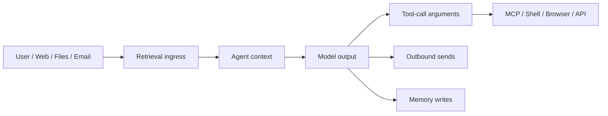

# Agent Boundaries

Use Armorer Guard where text crosses a trust boundary.

Recommended checks:

- Retrieval ingress: `inspect-json` with `eval_surface=retrieved_content`.
- Tool-call arguments: `inspect-json` or `mcp-proxy` with `eval_surface=tool_call_args`.
- Outbound sends: `inspect-json` with destination and policy scope.
- Memory writes: scan proposed memory text before persistence.
