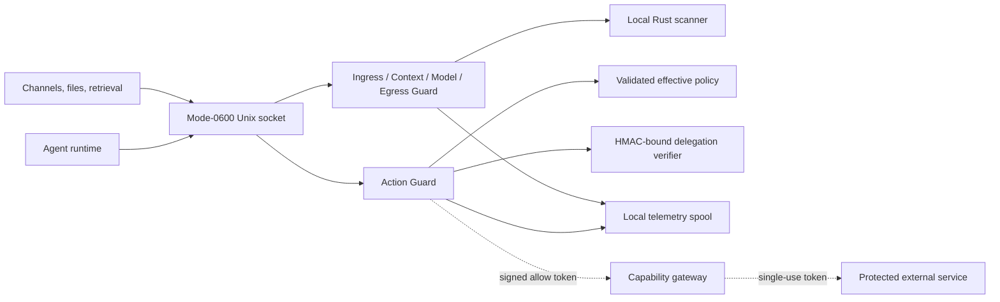

# ADR: Local-first Guard supervision runtime

Status: accepted and implemented for the local Unix-socket runtime.

## Decision

Guard runs as a persistent process beside an agent and exposes an HTTP-shaped
JSON API over a mode-`0600` Unix socket. It has two contract families:

1. Content supervision decides whether structured information is admitted,
   redacted, quarantined, reviewed, or denied.
2. Authority supervision decides only `allow`, `deny`, or
   `require_approval` immediately before a capability is dispatched.

The Rust scanner remains the content-inspection engine. The existing
identity-bound policy evaluator remains the Action Guard decision engine. The
runtime appends privacy-preserving events to a crash-flushed local JSONL spool.
Raw segment text is inspected locally but is not written to telemetry.

An `allow` response contains a signed short-lived execution token, not an
execution receipt. The gateway atomically consumes the token before dispatch;
the downstream outcome then produces the execution receipt. A `deny` or
`require_approval` response includes a persisted non-dispatch receipt.

## Trust boundaries



The socket boundary authenticates local filesystem access, not tenant or agent
identity. Identity is therefore mandatory in every contract and is evaluated
again by policy. Remote TCP and workload-identity authentication are out of
scope for this kernel.

## Fixed contract behavior

- Serde `deny_unknown_fields` applies to every request and nested object.
- Schema versions are exact; unsupported versions are rejected.
- Each raw content segment must match its lowercase
  `content/sha256:<digest>` reference.
- Cross-tenant segments, resources, and destinations are denied.
- Untrusted content cannot declare system, developer, or user instruction
  authority.
- Missing, invalid, or expired delegation is denied.
- Mutable policy cannot disable the existing fixed invariants.
- Adaptive evaluation can tighten an allow but cannot create one.
- Content transformations never appear as authority effects.
- Telemetry contains hashes, classifications, references, decisions, and
  reasons, but not raw segment text.

## Implemented local API

```text
POST /v1/input/evaluate
POST /v1/context/evaluate
POST /v1/model/request/evaluate
POST /v1/model/response/evaluate
POST /v1/action/evaluate
POST /v1/output/evaluate
POST /v1/tool/result/evaluate
POST /v1/memory/read/evaluate
POST /v1/memory/write/evaluate
POST /v1/inter-agent/evaluate
POST /v1/approvals/challenges
POST /v1/approvals/consume
POST /v1/executions/authorize
POST /v1/executions/receipts
POST /v1/policies/simulate
POST /v1/policies/proposals
POST /v1/policies/activate
POST /v1/policies/rollback
POST /v1/policies/observe
POST /v1/telemetry/query
POST /v1/evidence/access
GET  /v1/policies/effective
GET  /v1/policies/history
GET  /v1/capabilities
GET  /v1/features
GET  /v1/enforcement/coverage
GET  /v1/health
GET  /v1/readiness
```

`health` reports process health. `readiness` reports ready only when policy,
delegation verification, and the execution gateway are configured.

Run locally:

```bash
cargo run -- serve \
  --socket /tmp/armorer-guard.sock \
  --data-dir /tmp/armorer-guard-data \
  --policy fixtures/runtime-policy.json \
  --delegation-key-file fixtures/runtime-delegation.key \
  --evidence-authorization-key-file fixtures/runtime-delegation.key
```

The checked-in key is development-only and must never be used in production.

## Content request contract

The same strict envelope is used at all five information-flow boundaries:

```json
{
  "schema_version": "armorer-guard-content-evaluation/v1",
  "request_id": "content-request/1",
  "trace_id": "trace/1",
  "session_id": "session/1",
  "subject": {
    "agent_id": "law-agent",
    "identity_id": "identity/law-agent-prod",
    "tenant_id": "tenant/pichardo-law"
  },
  "segments": [
    {
      "content_ref": "content/sha256:...",
      "origin": "uploaded_document",
      "principal_id": "user/cristian-leo",
      "tenant_id": "tenant/pichardo-law",
      "trust": "untrusted",
      "data_classes": ["legal_privileged"],
      "instruction_authority": "none",
      "retention": "local_only",
      "text": "..."
    }
  ],
  "destination": null
}
```

## Failure behavior

| Surface | Kernel behavior |
| --- | --- |
| Destructive or credential action | Fail closed if policy or verifier is unavailable |
| Cross-tenant content/action/output | Fixed deny |
| External output | Fail closed on suspicious output or destination mismatch |
| Sensitive model request | Quarantine on suspicious content |
| Suspicious model response | Require approval; embedded tool calls remain proposals |
| Ordinary untrusted input | Admit as untrusted data; never upgrade instruction authority |
| Telemetry append failure | Return an error; do not report a decision that was not recorded |
| Sidecar unavailable | Adapter/gateway responsibility; sensitive paths must fail closed |

## Forge authority restriction

Forge may read structured policy and telemetry evidence, propose policy-only
revisions, simulate them, and request rollout or rollback. It receives no
repository or application-source capability through this API. It cannot sign
its own proposals, supply its own approval, disable fixed invariants, broaden
authority automatically, mutate Guard binaries, or claim enforcement without
an execution receipt.

## Platform follow-ups

The repository implementation targets local Unix sockets. Windows named pipes,
remote mTLS/workload-identity transport, external credential-broker deployment,
and independent production certification remain platform and rollout work; they
cannot be represented as completed by local unit tests.
