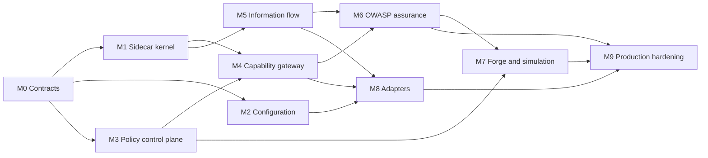

# Armorer Guard — Plane execution roadmap

Status: published and synchronized to the Armorer Plane project on 2026-08-08.
All 83 work items, 10 modules, and 18 roadmap labels are present. Unmerged but
verified implementation is tracked as **In Review**, never **Done**.

Plane project: `Armorer` (`ARM`); Guard roadmap items use the stable `GUARD-*`
external-ID prefix.

Project outcome: ship Armorer Guard as a local-first agent supervision runtime
that inspects information flow and enforces identity- and policy-bound authority
before effects occur, with measurable coverage of the OWASP Top 10 for Agentic
Applications 2026.

The import inventory is in [`plane_guard_work_items.csv`](./plane_guard_work_items.csv).
The CSV's `External ID` is the stable idempotency key for later Plane API
publication. Do not regenerate these IDs during import.

## Plane structure

- Project: **Armorer Guard — Agent Runtime Security Boundary** (`GUARD`)
- Modules: the ten modules below
- Cycles: create time-boxed cycles only after owners and capacity are known
- Labels: `guard`, `security-boundary`, `owasp-asi01` through `owasp-asi10`,
  `rust`, `typescript`, `python`, `mcp`, `breaking-contract`, `benchmark`
- Priorities: Urgent blocks a security boundary; High blocks a phase exit;
  Medium is required for production; Low is a supported follow-up
- States: Backlog, Planned, In Progress, In Review, Done, Blocked

## Current baseline

The `codex/policy-control-plane-20260807` worktree now has the local Linux
supervision runtime, signed layered policy control plane, capability and
approval gateway, structured information-flow boundaries, protected memory,
encrypted evidence authorization, Forge/Recon manifests, OWASP assurance tests,
and dependency-free framework adapters. Transport parity, credential-owning
brokers, cascading controls, approval presentation, encrypted replay, paired
attack/utility traces, adapter conformance, fuzz/recovery coverage, service
lifecycle, upgrade compatibility, and operational status are also implemented.
These changes are not merged, so 82 evidence-backed work items are **In Review**.
The independent external assessment remains **Backlog** because Armorer cannot
self-certify that release gate.

The current comparative benchmark against OWASP Agent Memory Guard uses 55
shared cases (40 malicious, 15 benign):

| Runtime | Recall | Precision | F1 | Known misses |
| --- | ---: | ---: | ---: | --- |
| OWASP Agent Memory Guard | 92.5% | 100% | 0.961 | GitHub token, Google key, JSON bomb |
| Armorer Guard supervised memory endpoint | 100% | 100% | 1.000 | None in this corpus |

This is a component benchmark, not proof that either product covers all ten
agentic risks. Guard's acceptance suite must validate enforceable runtime
outcomes and receipts, not detection alone.

## Module 0 — Contracts and threat model

Outcome: cross-language, fail-closed contracts define exactly what Guard can
inspect, authorize, transform, and prove.

Phase exit:

- Rust, TypeScript, and Python produce identical canonical representations.
- Unknown fields and unsupported schema versions fail closed.
- IDs, digests, signatures, approvals, tokens, and receipts have canonical
  encodings and test vectors.
- Coverage distinguishes mediated, observed-only, and bypassable routes.

## Module 1 — Persistent supervisor kernel

Outcome: one agent run is supervised across ingress, context, model request,
model response, action, and egress through a local sidecar.

Phase exit:

- A single trace links every boundary and its provenance edges.
- Sensitive actions fail closed when the sidecar is unavailable.
- Telemetry failure cannot produce an unrecorded enforcement claim.
- Health and readiness report different states.

## Module 2 — Agent configuration and operator experience

Outcome: an operator can configure an agent declaratively without embedding
policy or protected credentials in application code.

The target manifest must bind workload identity, tenant, models, data classes,
capabilities, destinations, fail modes, policy bundle, approval routes,
retention, and adapter settings. Configuration compilation produces a signed,
inspectable effective snapshot; it does not grant authority.

Phase exit:

- `guard validate` rejects ambiguous, unknown, or unsafe configuration.
- `guard explain` shows effective policy and why a capability is or is not
  mediated.
- A fresh agent can be integrated from documented TypeScript and Python
  quickstarts.
- The inventory identifies any direct route around Guard.

## Module 3 — Signed policy control plane

Outcome: policies are signed, layered, atomically activated, replayable, and
reversibly rolled back without weakening compiled invariants.

Phase exit:

- Tampered, unsigned, expired, or discontinuous bundles are rejected.
- Fixed deny → explicit deny → approval → explicit allow → default deny is
  deterministic across platforms.
- Rollback restores byte-identical policy and identical decisions.
- Adaptive overlays can only tighten and always expire or remain explicitly
  pinned.

## Module 4 — Capability and approval gateway

Outcome: Guard becomes enforceable rather than advisory because the agent lacks
unmediated credentials and protected operations require single-use Guard
authorization.

Phase exit:

- Protected operations cannot execute without a valid, short-lived token.
- Approval binds normalized arguments, identity, capability, resource, tenant,
  request, policy revision, expiration, and maximum use count.
- Argument mutation invalidates approval.
- Deny and missing-approval paths generate proof of non-dispatch.
- A decision receipt is never represented as an execution receipt.

## Module 5 — Full information-flow supervision

Outcome: provenance and destination-aware controls cover context, output,
memory, tool arguments, retrieved content, and inter-agent messages.

Phase exit:

- Untrusted content never gains instruction authority.
- Cross-tenant content cannot enter context or leave through any output path.
- Sensitive output is buffered until validation completes.
- Redaction is deterministic and its transformation is receipted.
- Raw evidence remains local, encrypted, retention-limited, and separately
  authorized.

## Module 6 — OWASP Agentic Top 10 assurance

Outcome: each OWASP risk has explicit preventive controls, bypass tests,
legitimate utility traces, and an evidence-backed coverage status.

Risk names:

1. ASI01 Agent Goal Hijack
2. ASI02 Tool Misuse & Exploitation
3. ASI03 Identity & Privilege Abuse
4. ASI04 Agentic Supply Chain Vulnerabilities
5. ASI05 Unexpected Code Execution
6. ASI06 Memory & Context Poisoning
7. ASI07 Insecure Inter-Agent Communication
8. ASI08 Cascading Failures
9. ASI09 Human-Agent Trust Exploitation
10. ASI10 Rogue Agents

Phase exit:

- All ten risks have mapped controls and executable end-to-end tests.
- Every claimed block has an execution receipt or downstream token rejection.
- False-positive rate and legitimate utility preservation are reported beside
  prevention rate.
- The Agent Memory Guard corpus remains a regression suite, with Armorer's
  credential, PII, size-anomaly, and role-override gaps closed or explicitly
  risk-accepted.

## Module 7 — Simulation and Forge integration

Outcome: Forge improves policy from structured evidence without source-code or
raw-content access and cannot approve or activate its own authority expansion.

Phase exit:

- Replay compares current and proposed decisions deterministically.
- Attack prevention and utility preservation are measured together.
- Shadow and canary rollout are atomic and observable.
- Defined safety or utility regression automatically requests or performs an
  authorized rollback.
- Forge's API has no repository, patching, signing, or binary mutation route.

## Module 8 — Framework adapters

Outcome: official adapters all preserve the same identity, tenant, provenance,
approval, decision, and receipt semantics while leaving the sidecar/gateway as
the security boundary.

Phase exit:

- A shared conformance suite produces identical policy outcomes.
- No adapter can omit mandatory identity or provenance.
- Approval suspension/resumption is race-safe and replay-safe.
- Direct bypass appears in the enforcement coverage inventory.

## Module 9 — Production hardening and operations

Outcome: Guard is deployable, recoverable, measurable, and independently
assessable on supported platforms without a network dependency for ordinary
enforcement.

Phase exit:

- No sensitive path fails open.
- Policy parity is deterministic across supported platforms.
- Local p95 targets are met: action under 10 ms, cached identity under 5 ms,
  ordinary text inspection under 50 ms, activation and rollback under 1 second.
- Crash recovery, bounded telemetry, disk pressure, upgrades, and rollback are
  tested.
- Independent end-to-end security review passes.

## Release gates and dependency chain

No module completion may be inferred from scanner detections alone. The first
security-boundary release requires Modules 0–6; Forge and broad framework
support may follow, but production status requires Module 9.

## Definition of done for every security work item

- Implementation and negative-path tests are merged.
- Contract fixtures exist for every new or changed boundary.
- Fail mode is documented and tested during dependency failure.
- Telemetry contains sufficient evidence without exporting raw content.
- A bypass test demonstrates that the control cannot be skipped through a
  supported integration path.
- Documentation states whether the result is detection, decision, or proven
  enforcement.
- Any OWASP coverage claim links to executable evidence and a receipt.

## Plane publication requirements

To publish this inventory through Plane's current API, the publisher needs:

1. Plane Cloud or self-hosted API base URL.
2. Workspace slug.
3. Existing project ID, or permission to create project `GUARD`.
4. An API key supplied through a secret store or process environment, never
   committed to this repository.
5. Optional owner/member UUIDs if modules and work items should be assigned.

Use Plane's `/work-items/` API, not the deprecated `/issues/` routes. Import by
`External ID`, then add returned work-item IDs to modules. Re-running the import
must update matching external IDs instead of creating duplicates.
